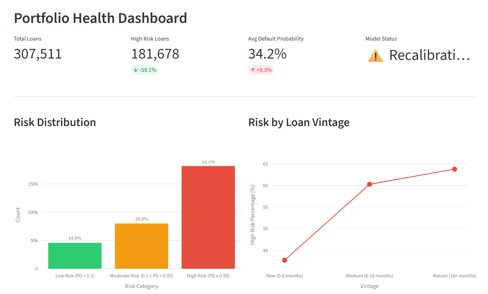

# Credit Risk Early Warning System (CREWS)

[](https://credit-risk-early-warning-system.streamlit.app)
[](https://www.python.org/downloads/)
[](https://opensource.org/licenses/MIT)

> **AI-powered credit risk prediction system with autonomous portfolio surveillance agent**

An end-to-end credit risk assessment system that combines machine learning-based credit scoring with an autonomous AI agent for portfolio monitoring and early warning alerts. Built with XGBoost, SHAP, Anthropic Claude API, and Streamlit.

---

## Live Demo

**[Launch Interactive Dashboard](https://credit-risk-early-warning-system.streamlit.app)** | [View Notebooks](notebooks/) | [AI Agent Report](notebooks/05_portfolio_surveillance.ipynb)

---

## Project Overview

This project demonstrates a complete Banking Data Science workflow, from data exploration to production deployment. It is an End-to-end credit risk modeling system with AI-powered portfolio surveillance for proactive default prediction in consumer lending. The system:

1. **Predicts credit default probability** using gradient boosting models (XGBoost)
2. **Explains predictions** using SHAP + LIME dual explainability for regulatory compliance
3. **Monitors portfolio risk** through an autonomous AI agent (Claude Sonnet 4)
4. **Generates actionable alerts** when risk thresholds are breached
5. **Visualizes insights** through an interactive Streamlit dashboard

---

## Key Features

- **Autonomous AI Agent** for portfolio surveillance powered by Claude Sonnet 4 API
- **Interactive Streamlit Dashboard** with real-time risk assessment
- **216 Engineered Features** with XGBoost gradient boosting across 7 data sources
- **Dual Explainability (SHAP + LIME)** for regulatory compliance and audit trail
- **Business Profit Optimization** using cost-sensitive evaluation
- **Portfolio Analytics** with vintage analysis and distribution drift detection
- **Banking Compliance** aligned with Basel III/IV, SR 11-7, IFRS 9, EU AI Act, FINMA, and Swiss nDSG

---

## Project Showcase

### AI Agent Portfolio Surveillance
*Autonomous agent performing hierarchical portfolio health check with 4-phase analysis protocol (Phase A: Data Integrity → Phase B: Risk Flagging → Phase C: SHAP Deep-Dive → Phase D: Watch List & Recommendations)*

### Interactive Dashboard

*Real-time portfolio monitoring with risk distribution and vintage analysis*

---

## Business Impact

The AI surveillance agent (April 8, 2026 run) identified **key portfolio risks** requiring action:

| Metric | Finding | Impact |
|--------|---------|--------|
| **High-Risk Loans** | 7,370 borrowers (11.98% of test portfolio) | PD > 0.79 business threshold |
| **Distribution Drift** | EXT_SOURCE_3: 19.83% missingness flagged | Data pipeline review required |
| **Watch List** | 16,045 entries saved | Combined Expected Loss: $3.88B |
| **Recommendations** | 4 strategic actions generated | Regulatory compliance maintained |

## Key Results
- **Portfolio Size**: 307,511 loans
- **High-Risk Loans Identified**: 7,370 (11.98% at PD > 0.79 business threshold)
- **Average Default Probability**: 8.07% (baseline rate)
- **Model Performance**: AUC 0.7778, Gini 0.5556

### Strategic Recommendations Generated (April 8, 2026):
1. **Enhanced monitoring** for 7,370 borrowers exceeding PD > 0.79 business threshold
2. **Intensive collection outreach** for top 5 critical exposures (combined EL = $1.24M)
3. **Data pipeline review**: EXT_SOURCE_3 missingness at 19.83% — validate external score feed
4. **Quarterly model revalidation** on schedule — no significant AUC drift detected

---

## Architecture
```
┌──────────────────────────────────────────────────────────────┐
│                     DATA LAYER                               │
│  Home Credit Dataset → Feature Engineering → Model Training  │
└──────────────────────────────────────────────────────────────┘
                              │
                              ▼
┌──────────────────────────────────────────────────────────────┐
│                   ML MODEL LAYER                             │
│  XGBoost Credit Scoring + SHAP Explainability                │
└──────────────────────────────────────────────────────────────┘
                              │
                              ▼
┌──────────────────────────────────────────────────────────────┐
│                   AI AGENT LAYER                             │
│  Autonomous Risk Monitor (Claude API) → Alert Generation     │
└──────────────────────────────────────────────────────────────┘
                              │
                              ▼
┌──────────────────────────────────────────────────────────────┐
│                 PRESENTATION LAYER                           │
│  Streamlit Dashboard → Risk Reports → User Alerts            │
└──────────────────────────────────────────────────────────────┘
```

---

## Dataset

This project uses the [Home Credit Default Risk](https://www.kaggle.com/c/home-credit-default-risk) dataset from Kaggle, containing:

- **307,511** loan applications
- **122** original features including demographics, credit history, and payment behavior
- **216** engineered features through aggregations, ratios, and interactions across 7 data sources
- Real-world data from a consumer finance provider

---

## Project Structure
```
credit-risk-early-warning-system/
├── notebooks/
│   ├── 01_eda.ipynb                    # Exploratory Data Analysis
│   ├── 02_preprocessing.ipynb          # Feature Engineering (216 features)
│   ├── 03_modeling.ipynb               # XGBoost with Class Imbalance Handling
│   ├── 04_explainability.ipynb         # SHAP Analysis & Model Interpretation
│   └── 05_portfolio_surveillance.ipynb # AI Agent Implementation (Claude API)
│
├── app.py                              # Streamlit Dashboard (5 tabs)
├── models/                             # Trained XGBoost Models
├── data/                               # Home Credit Default Risk Dataset
│   ├── raw/                            # Original Kaggle data
│   └── processed/                      # Engineered features
├── docs/screenshots/                   # Project Documentation
├── requirements.txt                    # Python Dependencies
└── README.md
```

---

## Tech Stack

| Category | Technologies |
|----------|-------------|
| **Data Processing** | Pandas, NumPy |
| **Machine Learning** | Scikit-learn, XGBoost with 216 engineered features |
| **Explainability** | SHAP (SHapley Additive exPlanations) values for interpretability |
| **AI Agent** | Anthropic Claude Sonnet 4 API for autonomous surveillance |
| **Visualization** | Matplotlib, Seaborn, Plotly |
| **Web Application** | Streamlit dashboard + SQLite database |
| **Deployment** | Streamlit Cloud |
| **Version Control** | Git, GitHub |

---

## Model Performance

| Metric | Value | Description |
|--------|-------|-------------|
| **ROC-AUC** | 0.7778 | Area Under ROC Curve (Isotonic-calibrated) |
| **Gini Coefficient** | 0.5556 | Model discriminatory power (2×AUC − 1) |
| **KS Statistic** | computed live | Kolmogorov-Smirnov — displayed in dashboard |
| **Brier Score** | 0.0668 | Probability calibration accuracy |
| **5-Fold CV AUC** | 0.7755 ± 0.0035 | Cross-validation stability |

### Key Technical Achievements:
- **216 engineered features** across 7 data sources including bureau, previous applications, and ratios
- **Class imbalance handling** via scale_pos_weight = 11.39
- **Cost-sensitive threshold optimization** with business profit maximization (threshold = 0.79)
- **Isotonic Regression calibration** for regulatory-grade PD estimates (IFRS 9 / Basel III)
- **Dual SHAP + LIME explainability** for every prediction (SR 11-7 / EU AI Act gold standard)
- **Autonomous monitoring** via AI agent with 4-phase hierarchical analysis protocol

---

## AI Agent Capabilities

The autonomous portfolio surveillance agent:
- **Analyzes portfolio-level risk metrics** across 307K+ loans
- **Identifies high-risk customer segments** (PD > 0.79 business-optimal threshold)
- **Detects distribution drift** in critical credit features
- **Performs vintage analysis** to identify performance trends
- **Generates natural language risk reports** with strategic recommendations
- **Triggers alerts** when risk thresholds are breached
- **Maintains audit trail** for regulatory compliance

### Agent Architecture:
- **SDK:** Anthropic Claude Sonnet 4
- **Tools:** 5 custom functions (database query, news search, risk analysis, reporting, audit logging)
- **Protocol:** Hierarchical 4-phase analysis (validation → flagging → deep-dive → recommendations)
- **Explainability:** SHAP-based feature attribution for individual borrower analysis

---

## Banking & Regulatory Compliance

This system is designed to align with international banking standards:

| Framework | Compliance Area |
|-----------|----------------|
| **SR 11-7** | Model Risk Management — ongoing monitoring and validation |
| **Basel III/IV** | Capital Adequacy — risk-weighted asset calculation, IRB approach |
| **IFRS 9** | Expected Credit Loss — forward-looking ECL provisioning (PD × LGD × EAD) |
| **ECOA / Reg B** | Fair Lending — SHAP-based adverse action notices |
| **GDPR Art. 22** | Right to Explanation — automated decision transparency (EU) |
| **EU AI Act (2024)** | High-Risk AI System — Arts. 9–15 (data governance, transparency, human oversight) |
| **FINMA 2017/1** | Swiss Model Risk Management — model inventory, validation, monitoring |
| **Swiss nDSG** | Federal Data Protection Act — automated profiling, right to explanation |

### Credit Risk Fundamentals

This project implements the **Expected Loss** framework:
```
Expected Loss (EL) = PD × LGD × EAD
```

Where:
- **PD** (Probability of Default): Predicted by our XGBoost model
- **LGD** (Loss Given Default): Percentage of exposure lost if default occurs
- **EAD** (Exposure at Default): Total amount at risk at default time

---

## Quick Start

### Prerequisites

- Python 3.11+
- pip or conda
- Kaggle account (for dataset download)
- Anthropic API key (optional - only needed for AI agent notebook)

### Installation
```bash
# Clone the repository
git clone https://github.com/JuanCRuizA/credit-risk-early-warning-system.git
cd credit-risk-early-warning-system

# Create conda environment
conda create -n credit-risk python=3.11 -y
conda activate credit-risk

# Install dependencies
pip install -r requirements.txt
```

### Download Dataset

1. Go to [Kaggle Home Credit Competition](https://www.kaggle.com/c/home-credit-default-risk/data)
2. Download `application_train.csv` and `application_test.csv`
3. Place files in `data/raw/`

### Run the Dashboard
```bash
# Launch Streamlit dashboard
streamlit run app.py
```

### Run Jupyter Notebooks
```bash
# Install Jupyter (if not already installed)
pip install jupyter

# Launch Jupyter Lab
jupyter lab

# Navigate to notebooks/ and run in sequence (01 → 05)
```

---

## Educational Value

This project demonstrates:

1. **End-to-End ML Pipeline** - From EDA to deployment
2. **Production-Ready Code** - Modular, documented, version-controlled
3. **Banking Domain Knowledge** - Credit risk concepts, regulatory frameworks
4. **Advanced AI Techniques** - Autonomous agents, explainable AI
5. **Business Acumen** - Profit optimization, strategic recommendations
6. **Deployment Skills** - Cloud-based dashboard with interactive UI

---

## Contact & Connect

**Juan Carlos Ruiz Arteaga** - MSc Data Science & AI, University of Liverpool

**[LinkedIn](http://www.linkedin.com/in/%20juancarlosruizarteagasep72)** | **[Email](mailto:carlosarte11@gmail.com)** | **[Portfolio](https://github.com/JuanCRuizA)**

---

## Acknowledgments

- **Dataset:** [Home Credit Default Risk](https://www.kaggle.com/c/home-credit-default-risk) - Kaggle Competition
- **AI Agent:** Powered by Anthropic Claude Sonnet 4
- **Deployment:** Streamlit Cloud
- **University:** University of Liverpool - MSc Data Science & AI Program

---

## License

This project is licensed under the MIT License - see the [LICENSE](LICENSE) file for details.

---

**If you find this project useful for your learning or career, please consider giving it a star!**

---

<div align="center">
  <sub>Built with love for the Banking, Financial Services, and Insurance (BFSI) sector</sub>
  <br>
  <sub><em>GOD first, this project was built as part of my journey to become a Banking Data Scientist, combining technical skills with a commitment to ethical AI and financial inclusion.</em></sub>
</div>